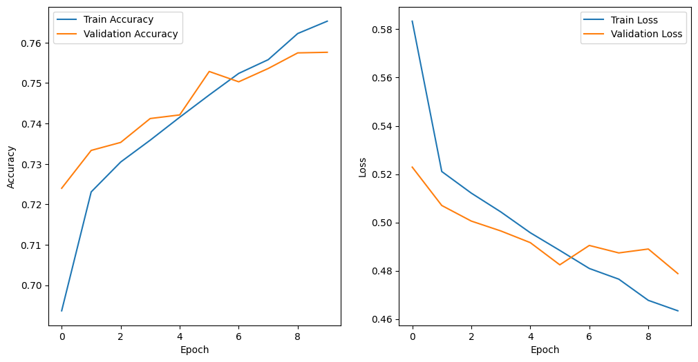
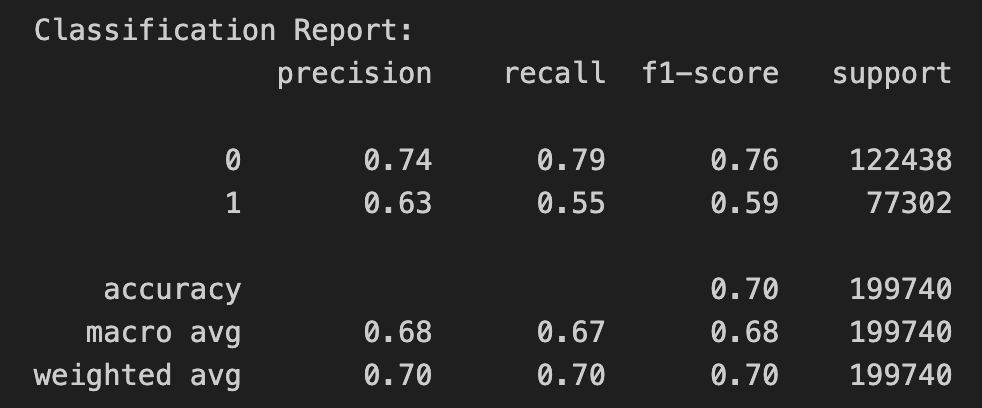

[](https://demo-picazo.streamlit.app)

# PiCazo: The GenAI/Fake Image Detector


Want to verify the authenticity of an image? PiCazo is a smart tool for the detection of fake images generated by popular Generative Artificial Intelligence (GenAI) systems.

## How to run the UI demo
```
pip install --upgrade streamlit
streamlit run https://raw.githubusercontent.com/caslab/picazo/picazo_app.py
```

## Project architecture
At a high-level, PiCazo consists of a labeled repository of images, a Convolutional Neural Network (CNN) model and a thin UI client.


## Data
PiCazo is powered by ArtiFact: *A Large-Scale Dataset with Artificial and Factual Images for Generalizable and Robust Synthetic Image Detection* [[GitHub](https://github.com/awsaf49/artifact), [Kaggle](https://www.kaggle.com/datasets/awsaf49/artifact-dataset)].

The training dataset comprises 8 sources carefully chosen to ensure diversity and includes images synthesized from 25 distinct methods, including 13 Generative Adversarial Networks (GANs), 7 Diffusion, and 5 other miscellaneous generators. It contains 2,496,738 images, comprising 964,989 real images and 1,531,749 fake images. Image resolution is 200x200px.

## Model
PiCazo uses a Convolutional Neural Network (CNN) to classify images as Real = 0 or Fake = 1.

A CNN is a type of artificial neural network designed for processing and analyzing visual data. CNNs are particularly effective in tasks like image recognition, object detection, and image classification.

Two alternative CNN designs have been tested:

1. Simple CNN [[picazo_lenet_5.ipynb](picazo_lenet_5.ipynb)]. A classical [LeNet-5](http://vision.stanford.edu/cs598_spring07/papers/Lecun98.pdf) design proposed by LeCun et al. in 1998 composed of an input and seven other layers: first convolutional (C1), first pooling (P1), second convolutional (C2), second pooling (P2) and three fully connected layers (FC1, FC2 and FC3).

2. Pre-trained CNN [[picazo_efficientnet.ipynb](picazo_efficientnet.ipynb)]. Uses a base model called [EfficientNet](https://arxiv.org/pdf/1905.11946.pdf), which is a type of neural network architecture designed to achieve high performance with relatively fewer parameters compared to traditional models, and two additional dense layers with dropout.

## Hyperparameter optimization
The CNNs have been optimized for high accuracy through hyperparameter tuning using Bayesian Optimization with a Gaussian Process regressor.s

Some other choices:
- Adamax (short for Adaptive Moment Estimation) optimization algorithm.
- Categorical crossentropy loss function.
- Validation accuracy for performance assessment.

## Frameworks
The classifier code has been produced using Python and relevant ML libraries such as Keras, KerasTuner and scikit-learn.

The frontend UI has been produced using Streamlit, a free and open-source framework to rapidly build and share beautiful machine learning and data science web apps.

## Results
This is a performance comparison after running the tuned CNNs (best models) on the full dataset (~2.5M images) for 10 epochs each and later evaluating on the test set (~200K images).

| Metric                    | LeNet-5                                    | EfficientNet                                     |
|---------------------------|:------------------------------------------:|:-------------------------------------------------:|
| Train/Validation Accuracy |  |  |
| Test Accuracy             | 0.7003                                     | 0.7583                                           |
| Test Loss                 | 0.5478                                     | 0.4789                                           |
| Test Confussion Matrix    |         |         |
| Test Stats                |      |      |


## Useful resources

* 💾 [Datasheet](data_sheet.md)
* 💳 [Model card](model_card.md)
* 📒 Notebooks [picazo_lenet_5.ipynb](picazo_lenet_5.ipynb) and [picazo_efficientnet.ipynb](picazo_efficientnet.ipynb)

## Questions? Comments?
Please reach out to [victor@caslab.ventures](mailto:victor@caslab.ventures).

