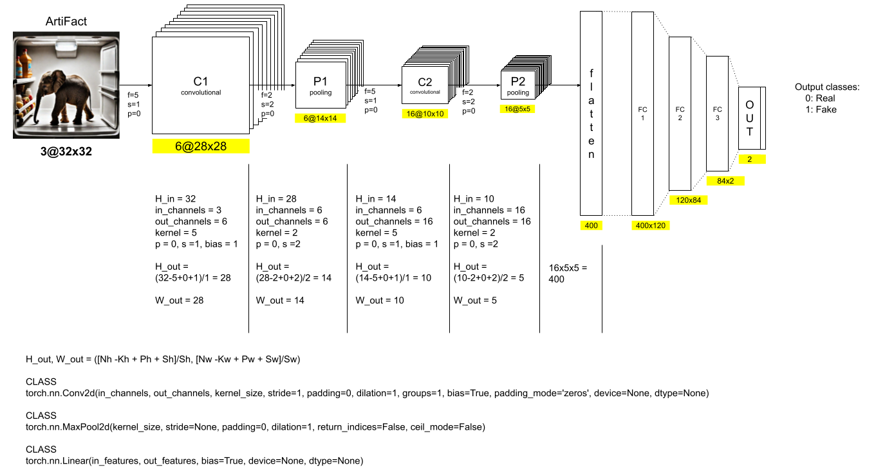
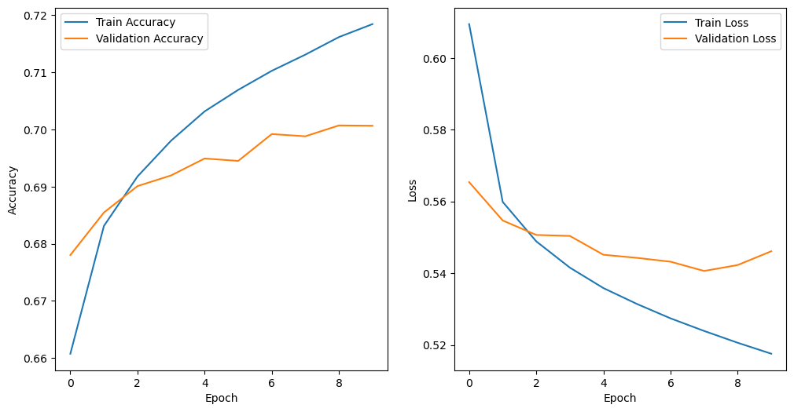
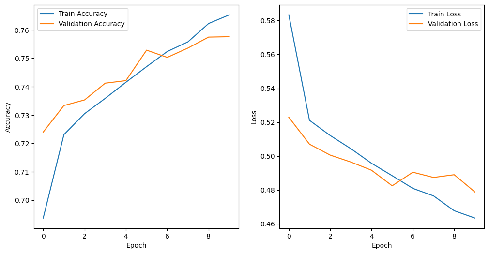
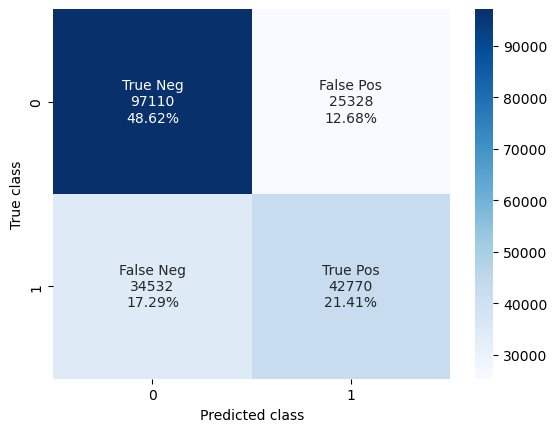
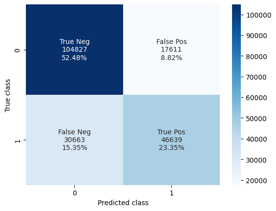
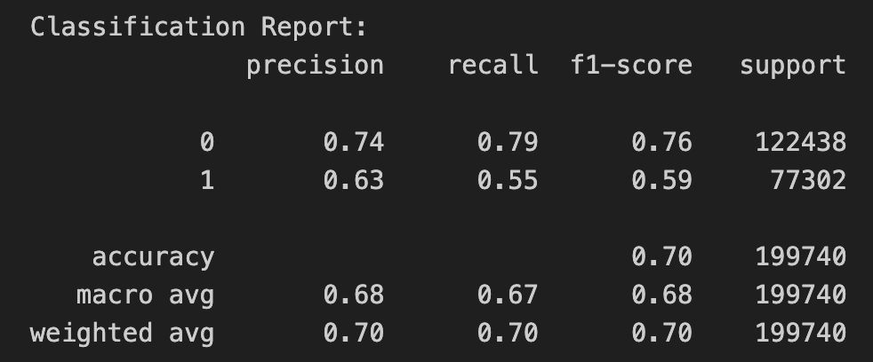
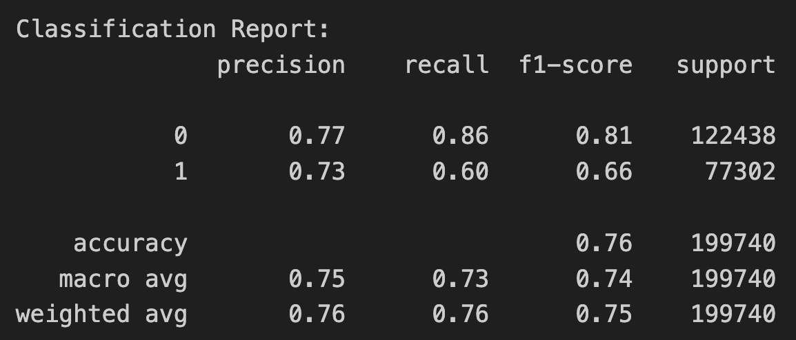

# PiCazo Model Card

## Model Description

**Input:** Color image(s). 

**Output:** Image classification as 'Real' (0) or 'Fake' (1)

**Model Architecture:** 

Two different model architectures have been tested as part of this project:

1. Simple CNN [[picazo_lenet_5.ipynb](picazo_lenet_5.ipynb)]. A classical [LeNet-5](http://vision.stanford.edu/cs598_spring07/papers/Lecun98.pdf) design proposed by LeCun et al. in 1998 composed of an input and seven other layers: first convolutional (C1), first pooling (P1), second convolutional (C2), second pooling (P2) and three fully connected layers (FC1, FC2 and FC3).

2. Pre-trained CNN [[picazo_efficientnet.ipynb](picazo_efficientnet.ipynb)]. Uses a base model called [EfficientNet](https://arxiv.org/pdf/1905.11946.pdf), which is a type of neural network architecture designed to achieve high performance with relatively fewer parameters compared to traditional models, and two additional dense layers with dropout.

## Performance

This is a performance comparison after running the tuned CNNs (best models) on the full dataset (~2.5M images) for 10 epochs each and later evaluating on the test set (~200K images).

| Metric                    | LeNet-5                                    | EfficientNet                                     |
|---------------------------|:------------------------------------------:|:-------------------------------------------------:|
| Train/Validation Accuracy |  |  |
| Test Accuracy             | 0.7003                                     | 0.7583                                           |
| Test Loss                 | 0.5478                                     | 0.4789                                           |
| Test Confussion Matrix    |         |         |
| Test Stats                |      |      |

## Limitations

Both models were trained on a MacBook Pro with an Apple M1 Pro chip and 16GB of RAM.

Due to time limitations, Bayesian Optimization for hyper-parameter tuning was performed 10 times (trials) for 2 iterations (epochs) each and over just 25% of the total dataset. This was a fast and cheap way of choosing the best performing parameters for each model.

Due to time limitations as well, re-training on the full dataset with the best models (best parameters) was done over 10 epochs. However, as it can be appreciated on the Train/Validation accuracy charts above, some of the metrics hadn't plateaued completely and would have probably required more iterations. 

## Trade-offs

Image Resolution vs. Latency and Memory:
It is well known that training latency increases proportionally with image pixel count. In order to make training feasible in time and space, two practical techniques were applied:

1. Downscaling [ArtiFact](https://github.com/awsaf49/artifact) dataset images from 200x200 pixels to 32x32 pixels. This improved speed but may have affected model performance.

2. Lazy loading via [Data Generators](https://stanford.edu/~shervine/blog/keras-how-to-generate-data-on-the-fly). This prevented out of memory (RAM) kernel crash errors but resulted in an increased I/O overhead and made debugging more complicated as the full dataset couldn't be inspected in one go.
